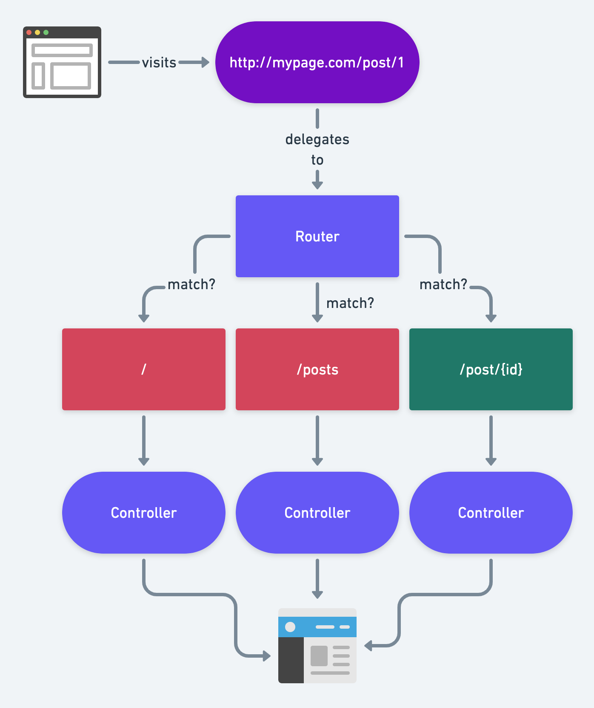

# What is route?

Routes act as the entry points for incoming web requests and serve as a crucial component for defining the URL structure of our application. They essentially map URLs to controllers or closures that handle the requests and generate appropriate responses. Think of routes as the table of contents or navigation system for your web application, directing users to different sections or pages based on the URLs they visit.

<div align="left">
    
</div>

## Defining Routes

Routes in Laravel are typically defined in the `routes/web.php` file for web routes and `routes/api.php` for API routes. The `web.php` file contains routes that are accessed via web browsers, while `api.php`contains routes for APIs.

Example of a basic route:

```
Route::get('/about', function () {
    return 'About page';
});
```

## HTTP Verbs

Laravel supports various HTTP verbs such as `GET`, `POST`, `PUT`, `PATCH`, `DELETE`, etc. for defining routes.
These verbs correspond to different actions that can be performed on resources.

Example of a POST route:

```
Route::post('/submit-form', [UserController::class, 'your-function']);
```

## Route Parameters:

You can define route parameters to capture dynamic segments of the URL.
These parameters can then be accessed within your route callback or controller.

Example of a route with a parameter:

```
Route::get('/users/{id}', function ($id) {
    return 'User ID: ' . $id;
});
```

## Named Routes

Laravel allows you to name routes, making it easier to reference them within your application.
Named routes are especially useful when generating URLs or redirects.

```
Route::get("/profile", function(){
    return "Named Routes";
})->name('profile');
```

## Passing Data to views

Passing data from routes to views is a fundamental aspect of web development in Laravel.
It allows you to dynamically populate your views with data retrieved from various sources such as databases, APIs, or user input.

You can pass data directly from a route closure using the view helper function. Simply pass an associative array of data as the second parameter to the view function.

```
Route::get('/hello', function () {
    $name = 'John';
    return view('welcome', ['name' => $name]);
});
```

To `welcome.blade.php` access the data you have pass in your views:

```
<!-- welcome.blade.php -->
<h1>Hello, {{ $name }}</h1>
```

## Routes in views

Accessing routes in views allows you to generate URLs dynamically without hardcoding them.
Laravel provides several convenient methods for generating URLs to routes directly from your views.
Here's how you can access routes in views using Laravel's Blade templating engine:

- Generate a URL to the `profile` named route using `route` utility function:

  ```
  <a href="{{ route('profile') }}">Profile</a>
  ```

- Generate a URL to the `profile` if you didnt name your route:

  ```
  <a href="/profile">Profile</a>
  ```
