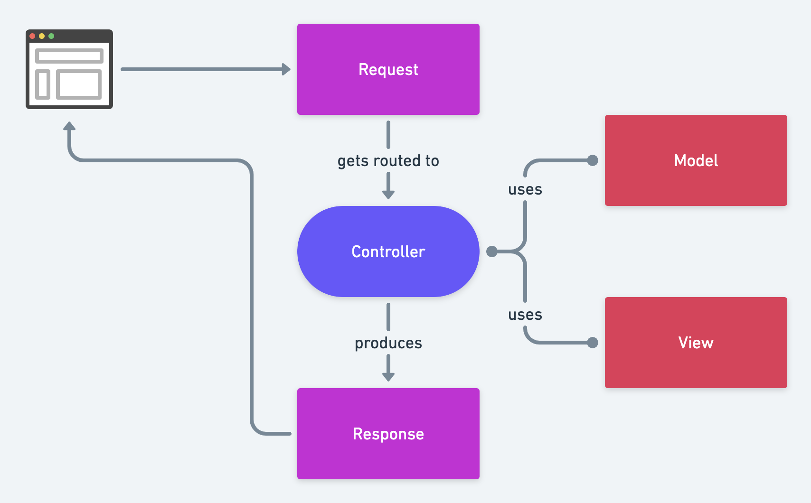

# Controllers

Laravel play a crucial role in handling incoming requests, processing data, and generating responses.
They serve as the intermediary between the routes and the views, encapsulating the application's logic.



## Creating a Controller

You can generate a new controller using Artisan, Laravel's command-line interface.
Open your terminal or command prompt and run the following command:

```
php artisan make:controller UserController
```

## Defining Controller Methods

Inside the controller file, you can define methods to handle different actions or requests.
These methods typically correspond to the CRUD operations (Create, Read, Update, Delete) or other actions your application needs to perform.

```
<?php

namespace App\Http\Controllers;

use Illuminate\Http\Request;

class UserController extends Controller
{
    public function index()
    {
        // Logic to fetch and display a list of users
    }

    public function show($id)
    {
        // Logic to fetch and display a specific user
    }

    public function store(Request $request)
    {
        // Logic to store a new user based on the data in $request
    }

    public function update(Request $request, $id)
    {
        // Logic to update an existing user based on the data in $request
    }

    public function destroy($id)
    {
        // Logic to delete an existing user
    }
}
```

## Routing to Controller Methods

Once you've defined your controller methods, you can route requests to these methods in your `routes/web.php` file. Use the `Route::` syntax to define routes and specify the controller method to be invoked.

```
use App\Http\Controllers\UserController;

Route::get('/users', [UserController::class, 'index']);
Route::get('/users/{id}', [UserController::class, 'show']);
Route::post('/users', [UserController::class, 'store']);
Route::put('/users/{id}', [UserController::class, 'update']);
Route::delete('/users/{id}', [UserController::class, 'destroy']);
```
