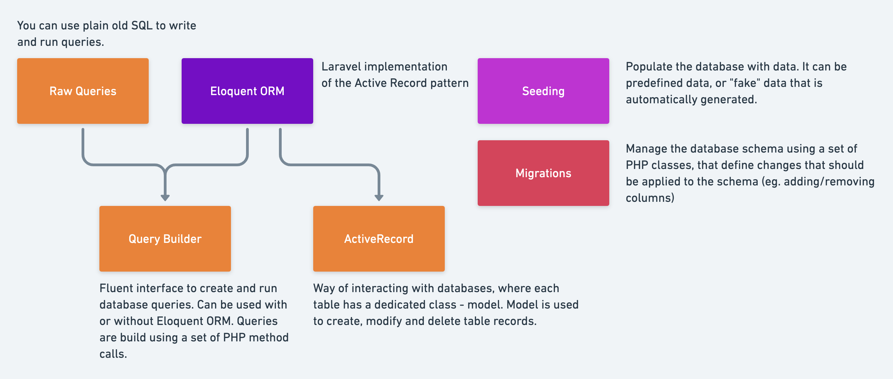

# Model

Laravel is an MVC based PHP framework. In MVC architecture, ‘M’ stands for ‘Model’.
A Model is basically a way for querying data to and from the table in the database.



# Creating a Model

You can generate a new model using Artisan's make:model command.
Models in Laravel typically represent individual database tables,
and they encapsulate the business logic related to those tables.

```
php artisan make:model User
```
