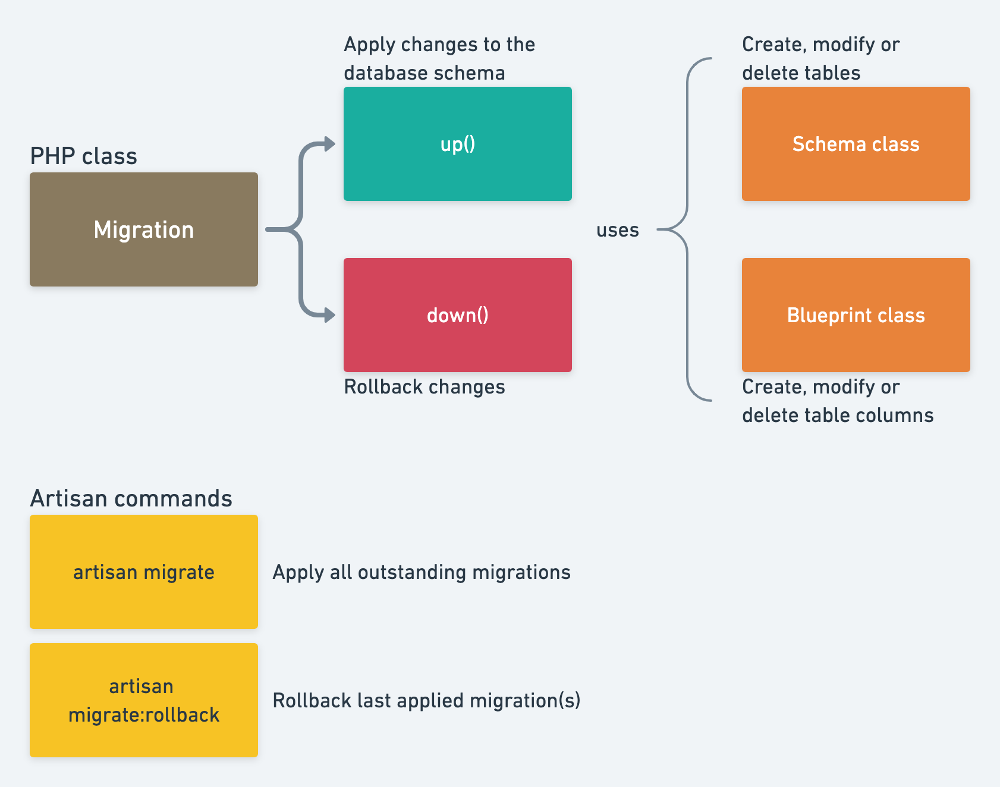

# Migrations

In Laravel, Migration provides a way for easily sharing the schema of the database.
It also makes the modification of the schema much easier.
It is like creating a schema once and then sharing it many times.
It gets very useful when you have multiple tables and columns as it would reduce the work over creating the tables manually.

the command we use to create a migrations:

```
php artisan make:migration create_users_table
```



## Running Migrations

Once you've defined your migration,
you can execute it to create the corresponding database table using the migrate Artisan command.

```
php artisan migrate
```

Start fresh migration

```
php artisan migrate:fresh
```

Note: Don't use this command on production cause it will remove all data in your database only use this command on development.

## Rolling Back Migrations

If you need to roll back a migration (e.g., to undo changes to the database schema), you can use the `migrate:rollback` command.

```
php artisan migrate:rollback
```

If you want to rollback only the last migration

```
php artisan migrate:rollback --step=1
```
