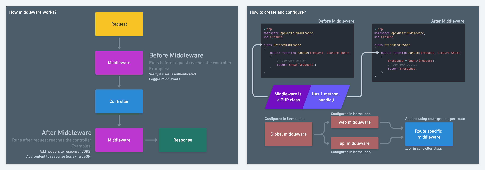

# Middleware

`Middleware` in Laravel plays a crucial role in intercepting `HTTP requests` entering your application. It provides a convenient mechanism for filtering requests based on various conditions before they reach your application's routes or controllers. `Middleware` can perform tasks such as `authentication`, `authorization`, `logging`, and `modifying incoming requests`.

## Creating Middleware

You can create `middleware` using the Artisan command-line tool. For example, to create a `middleware` named `Authenticate`, you would use:

```
php artisan make:middleware mustBeLoggedIn
```

This command generates a new middleware class in the `app/Http/Middleware` directory.

## Middleware Logic

The middleware logic is defined in the handle method of the middleware class. This method receives the incoming request and a closure representing the next middleware or the final destination (usually a controller). The middleware can perform tasks before and after calling the next middleware in the chain.



```
public function handle($request, Closure $next)
{
    // Perform tasks before the request is handled

    $response = $next($request);

    // Perform tasks after the request is handled

    return $response;
}
```

## Registering Middleware

You can register middleware globally or assign them to specific routes or groups of routes in the `app/Http/Kernel.php` file. The web middleware aliases or middleware group, for example, is applied to routes defined in the `routes/web.php` file.

```
 protected $middlewareAliases = [
        'mustBeLoggedIn' => \App\Http\Middleware\MustBeLoggedIn::class,
    ];
```

## Route Middleware

Route middleware allows you to apply middleware to specific routes or groups of routes. You can assign middleware to routes directly in the route definition using the middleware method or by specifying a middleware group.

```
Route::get('/profile', function () {
    // Profile page logic
})->middleware('mustBeLoggedIn');
```

inside your mustBeLoggedIn Middleware should look like this:

```
 public function handle(Request $request, Closure $next): Response
    {
       if(auth()->check()){
            return $next($request);
       } else{
            return redirect()->route("user.login")->with("error", "You must login to access this page");
       }
    }
```

In this example we create a before middleware, we want to verify if the user is currently logged in if not then redirect them back to user login page. if they are currently logged in they should be sent to the next step or to the respected controller.
